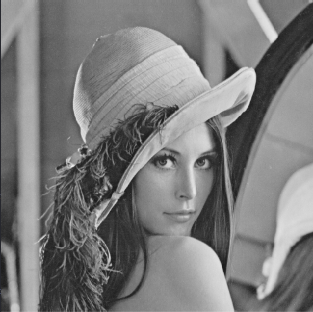
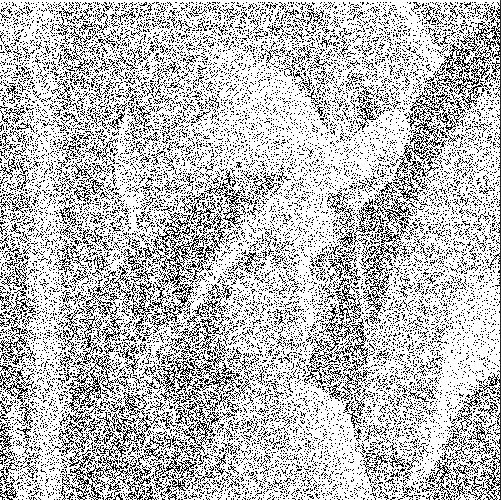

# Computer-Vision-Basic-Functions
<h3>Implementation and testing of basic image processing functions including noise addition &amp; filtration, kernels, normalization, and equalization</h3>

### Original Image
<p align="left"></p>

<br>
<br>

### 1.  Adding additive noise to the image.
<br>

#### Uniform
<p align="left"></p>
<br>

#### Gaussian
<p align="left"></p>
<br>

#### salt & pepper noise.
<p align="left"></p>

<br>
<br>
<br>

### 2.  Filter the noisy image using the following low pass filters.
   ### - Note: We can apply any type of filters with any type of noise (this is just example)
<br>

#### Average Filter
<p align="left"></p> 
<br>

#### Gaussian Filter
<p align="left"></p>
<br>

#### Median Filter.
<p align="left"></p>
<br>

### 3. Edge Detection
<br>

#### Sobel
<p align="left"></p>
<br>

#### Roberts 
<p align="left"></p>
<br>

#### Prewitt
<p align="left"></p>
<br>

#### Canny
<p align="left"></p> 
<br>

### 4. Draw histogram and distribution curve.
<br>

#### Histogram for Grey images
<p align="left"></p>
<br>

#### Distribution Curve for Grey images
<p align="left"></p>
<br>

### 5. Equalize the image
<br>

#### Equalized Image
<p align="left"></p>
<br>

#### Equalized Image Histogram
<p align="left"></p>
<br>

#### Equalized Image Distribution Curve.
<p align="left"></p>
<br>

### 6. Normalize the image.
<br>

#### Normalized Image to range (0-255)
<p align="left"></p>
<br>

#### Normalized Image Histogram
<p align="left"></p>
<br>

#### Normalized Image Distribution Curve
<p align="left"></p>
<br>

### 7. Thresholding
<br>

#### Original image
<p align="left"></p>
<br>

#### Global Thresholding (threshold = 80)
<p align="left"></p>
<br>

#### Local Thresholding (block size = 61)
<p align="left"></p>
<br>

### 8. Draw histogram and distribution curve for RGB images and convert them to grey scale.
<br>

#### Histogram for RGB images
<p align="left"></p>
<br>

#### Distribution Curve for RGB images
<p align="left"></p>
<br>

#### convertion from RGB to grey scale
##### original RGB
<p align="left"></p>
<br>

##### Grey scale (weighted and average method)
<p align="left"></p>
<br>


### 9. Filters in Frequency Domain
1. Low Pass Filter (After applying kernel with zeros outside and ones in the center so the result is blurring image)  as shown below :

<p align="left"></p>


2. High Pass Filter (After applying kernel with ones outside and zeros in the center so the result is edge enhanced image)  as shown below :

<p align="left"></p>

### 10. Hybrid Images.
<br>

1. First image will be filtered using low pass filter so we will take from this image the backgroung. Shown below the first image:
<p align="left"></p>

2. Second image will be filtered using high pass filter so we will take from this image its edges. Shown below the second image:
<p align="left"></p>

3. The result of adding both image:
<p align="left"></p>
<br>


## Important Note:
- These functions are applied individually on the image as the result would change if we applied all functions on the same image cumulatively
- To Run main.py "Virtual env"
    ```
    Set-ExecutionPolicy Unrestricted -Scope Process
    env\Scripts\act
    python main.py
    ```
